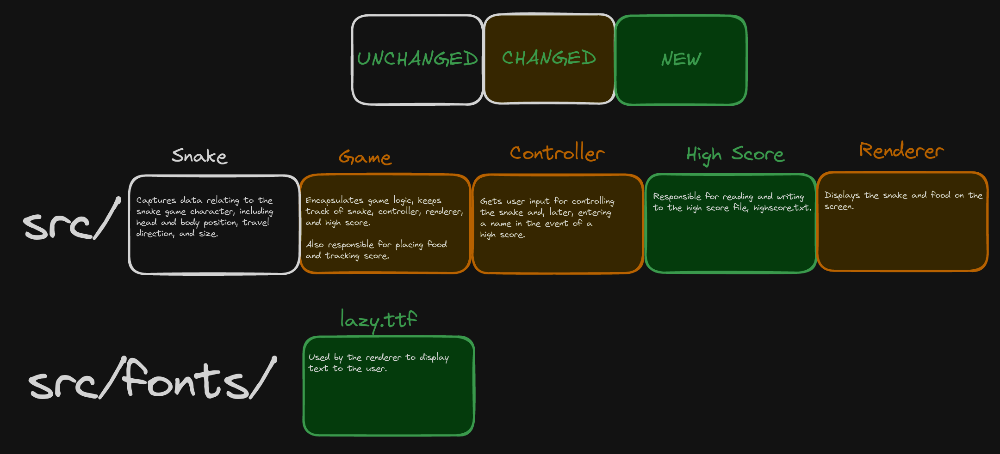

# Capstone Project
This repo houses my Udacity CppND Capstone. I have chosen to extend the Snake Game.

# Code Structure

# Building and Running
To build, run the following commands in a terminal:
- `cd <path_to_CppND-Capstone-Snake-Game/build`
- `mkdir build`
- `cd build`
- `cmake .. && make`

To run the game (after building), run the following commands in a terminal:
- `cd <path_to_CppND-Capstone-Snake-Game>/build`
- `./SnakeGame`

# Rubric Points Addressed
## Loops, Functions, I/O
I added a new class called `HighScore` which can be found in the `high_score.h` and `high_score.c` files. This class adds functions `ReadHighScoreFromFile()` and `WriteHighScoreToFile()` which, unsurprisingly, are responsible for reading and writing to a file which stores the high score between games. There are also two getter and setter functions `GetHighScore()` and `SetHighScore()` which are responsible for getting and setting the private data of the `HighScore` class.

The `HighScore` class fulfills the rubric points listed below:
1. **The project demonstrates an understanding of C++ functions and control structures.**
I have introduced new functions into the SnakeGame which encapsulate specific behavior.
2. **The project reads data from a file and process the data, or the program writes data to a file.**
The highscore is read from a file at the beginning of the game, and - if the player receives a new highscore -written back to the file at the end.
3. **The project uses Object Oriented Programming Techniques**
I have added a new class to the project, `HighScore`.`
4. **Classes use appropriate access specifiers for class members**
The member functions and variables in `HighScore` are either `Public` or `Private`.
5. **Classes encapsulate behavior**
High score functionality and data is encapsulated in the `HighScore` class.

Additionally, I have added another function to the `Controller` class called `HandleTyping()`. This function allows the player to enter their name in the event they get a high score. This function satisfies another rubric criteria:
6. **The project accepts user input and processes the input**
My class parses keystrokes and displays them to the user.